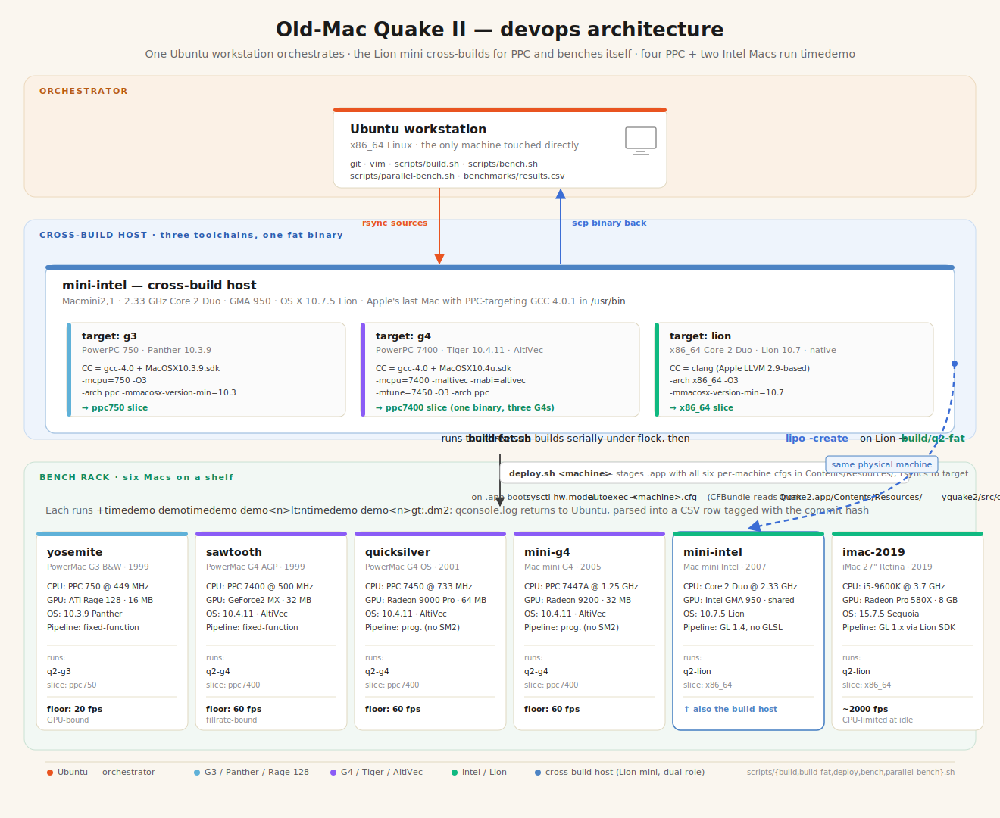
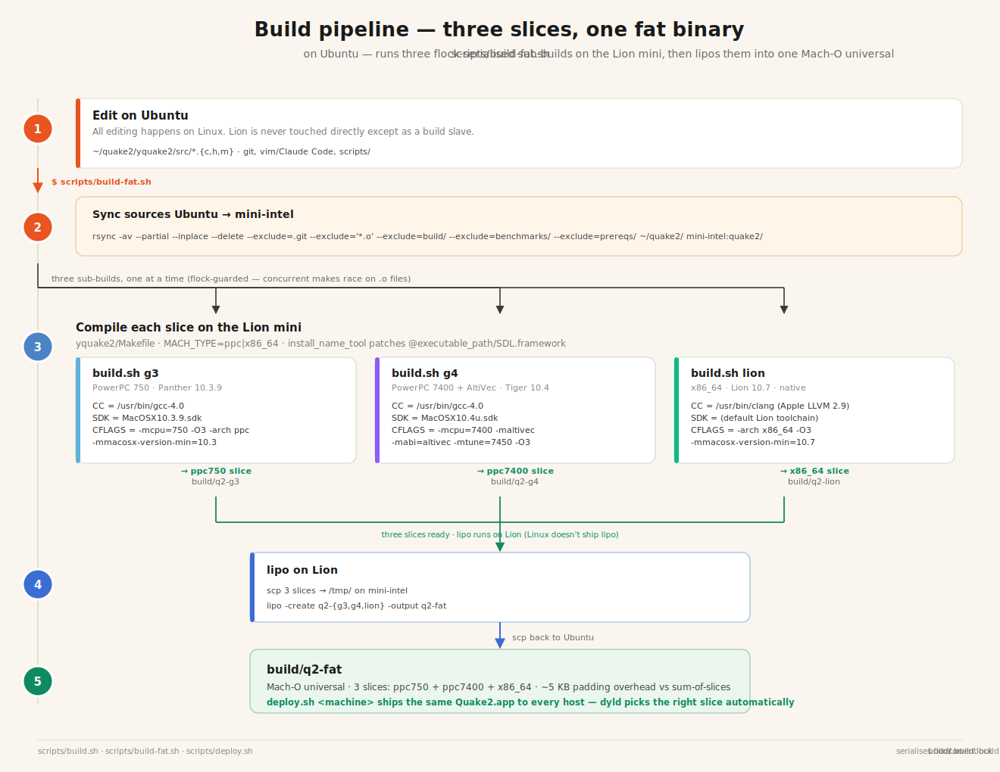
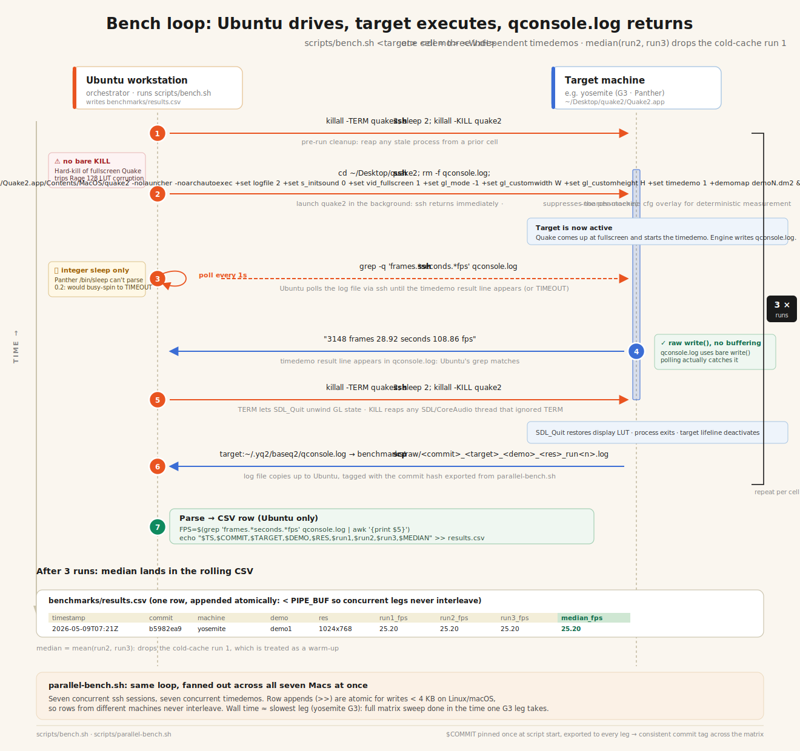

# Old-Mac Quake II — six retro Macs, one fat binary

[](yquake2/LICENSE)
[](#the-fleet)
[](#the-fleet)
[](https://github.com/yquake2/yquake2)

<p align="center">
  
</p>

yquake2 5.11 port tuned to six retro Macs spanning 1999–2019. One source tree, one fat universal binary (PPC G3 + PPC G4 AltiVec + Intel x86_64) inside a single self-contained `Quake2.app` bundle. Per-machine `autoexec.cfg` ships inside the .app and is dispatched by `sysctl hw.model` at boot. Sister project of [`old-mac-quakespasm`](https://github.com/matthewdeaves/old-mac-quakespasm).

## The fleet

| Machine | CPU | GPU | OS | Slice | GPU era |
|---|---|---|---|---|---|
| **yosemite** PowerMac1,1 1999 | 449 MHz PPC 750 | ATI Rage 128 16 MB | 10.3.9 Panther | `ppc_750` | fixed-function |
| **sawtooth** PowerMac3,1 1999 | 500 MHz PPC 7400 | NVIDIA GeForce2 MX 32 MB | 10.4.11 Tiger | `ppc_7400` | fixed-function |
| **quicksilver** PowerMac3,5 2001 | 733 MHz PPC 7450 | ATI Radeon 9000 Pro 64 MB | 10.4.11 Tiger | `ppc_7400` | early shader ATI |
| **mini-g4** PowerMac10,1 2005 | 1.25 GHz PPC 7447A | ATI Radeon 9200 32 MB | 10.4.11 Tiger | `ppc_7400` | early shader ATI |
| **mini-intel** Macmini2,1 2007 | 2.33 GHz Core 2 Duo | Intel GMA 950 64 MB | 10.7.5 Lion | `x86_64` | Intel integrated |
| **imac-2019** iMac19,1 2019 | 3.7 GHz i5-9600K | AMD Radeon Pro 580X 8 GB | 15.7 Sequoia | `x86_64` | modern AMD discrete |

## Current build — `timedemo demo1.dm2` (median)

Live data: [`benchmarks/results.csv`](benchmarks/results.csv) · screenshots: [`docs/screenshots/index.html`](docs/screenshots/index.html) · per-machine cfgs: [`scripts/bundle/`](scripts/bundle/).

| Machine | 640×480 | 1024×768 | Floor | Visual stack |
|---|---:|---:|---:|---|
| **imac-2019** | 711.75 | 726.40 | 60 | everything maxed (GPU never bound) |
| **mini-g4** | 123.80 | 98.45 | 60 | picmip 0, trilinear, AF 16x, dlights, OBB 4, retex, fog, waterwarp, group-draw |
| **mini-intel** \* | 59.40 | 101.20 | 60 | same as mini-g4 (AF 8x) |
| **quicksilver** | 72.40 | 72.35 | 60 | same as mini-g4 |
| **sawtooth** | 78.20 | 67.35 | 60 | picmip 0, trilinear, AF 2x, `gl_flashblend 1` halos, fog, waterwarp |
| **yosemite** | 45.15 | 25.10 | 20 | picmip 0, trilinear, alias shadows, AF 2x, GL_FOG, waterwarp |

\* Lion's Quartz vsync caps 640×480 at 60 fps; 1024×768 escapes the cap.

### Phase B/C features shipped (cherry-picked from yquake2-latest + KMQuake2)

| Feature | cvar | Source | Cost on R128 |
|---|---|---|---|
| Cvar-driven linear/exp fog | `gl_fog` + range/color | KMQuake2 `r_fog.c` | -0.6 fps |
| Underwater frustum sine-warp | `gl_waterwarp` | yquake2-latest | only underwater |
| Lightmap subrect dynamic upload | `gl_lightmap_subrect` | QS port | no-op if `gl_dynamic 0` |
| Group-draw batching (`qglDrawElements`) | `gl_groupdraw` | yquake2-latest `gl1_buffer.c` | -0.75 fps |
| stb_image-based JPEG decode | — | vendored `stb_image.h` | drops libjpeg dep |
| CFBundle HD-pak search path | — | `Q2_GetBundleHDPakPath` | one-time at FS init |

## How the binary picks its config

<p align="center">
  
</p>

All six per-machine cfgs ship inside `Quake2.app/Contents/Resources/`. The engine ([`yquake2/src/common/misc.c`](yquake2/src/common/misc.c) → `Q2_ExecConfigFromBundle`, called from `Qcommon_Init` after `CL_Init`) reads the one matching the host via `sysctlbyname("hw.model", ...)`. Layered after `default.cfg` → `yq2.cfg` → `config.cfg` so its cvars win.

## How it's built

<p align="center">
  
</p>

Cross-builds on mini-intel (last machine with working `gcc-4.0` + `MacOSX10.3.9.sdk` + `MacOSX10.4u.sdk`). Three flock-serialised sub-builds glued with `lipo -create` into `build/q2-fat/quake2`.

## How it's benched

<p align="center">
  
</p>

```bash
scripts/build-fat.sh                              # 3-arch universal binary
scripts/deploy.sh <machine>                       # ship to one of the 6 hosts
scripts/bench.sh <machine> demo1 1024x768 3       # 3 timedemo runs, append to CSV
scripts/parallel-bench.sh                         # full matrix, all reachable legs concurrent
```

Each cell in `benchmarks/results.csv` is tagged with the commit hash that produced it.

## Run it from any Quake 2 folder

```
<your dir>/
  Quake2.app/
    Contents/
      Info.plist
      MacOS/quake2                   (fat: ppc750 + ppc7400 + x86_64)
      MacOS/SDL.framework/           (fat: ppc + i386 + x86_64)
      Resources/Quake2.icns
      Resources/autoexec-*.cfg × 6   (per-machine, picked by sysctl)
  ref_gl.so
  baseq2/
    game.so
    pak0.pak  pak1.pak  pak2.pak   ← supply your own
```

The repo does **not** distribute `.pak` files — bring your own from Steam / GOG / retail CD.

## Repo layout

```
yquake2/         engine source (vendored at QUAKE2_5_11 tag, 033550cd)
scripts/
  build.sh           single-arch build via mini-intel
  build-fat.sh       3-arch lipo merge → build/q2-fat/
  deploy.sh          rsync fat .app to one machine
  bench.sh           one demo × resolution
  parallel-bench.sh  whole grid in parallel
  screenshot.sh      capture in-game PNGs from one host
  bundle/            Info.plist + autoexec-<machine>.cfg files (shipped inside .app)
benchmarks/      results.csv + raw qconsole.log per run
docs/
  images/        SVG architecture diagrams (rendered above)
  screenshots/   per-machine post-build screenshots + index.html gallery
  HD_PACK.md     bundle-vs-user HD texture pack install paths
MacOSX/          fat SDL.framework (ppc + i386 + x86_64), Quake2.icns
```

| Doc | Role |
|---|---|
| `PPC_PLAN.md` | Multi-phase roadmap (A bring-up, B GL1 cherry-picks, C visual-feature ports) |
| `CLAUDE.md` | Durable tribal knowledge |
| `MISTAKES.md` | Append-only log of approaches that failed |
| `NEXT_ROUND_PLAN.md` | Forward-looking engine work (KMQuake2 decals / stencil shadows / bloom, AltiVec SIMD, MSAA, gamma) |
