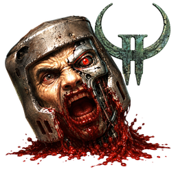
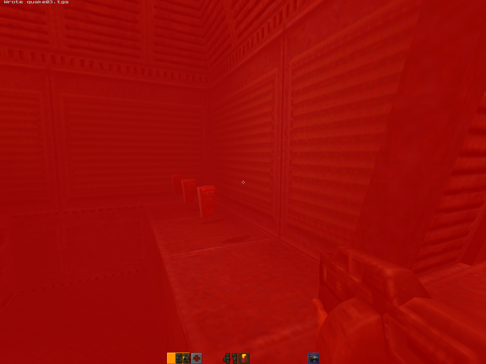
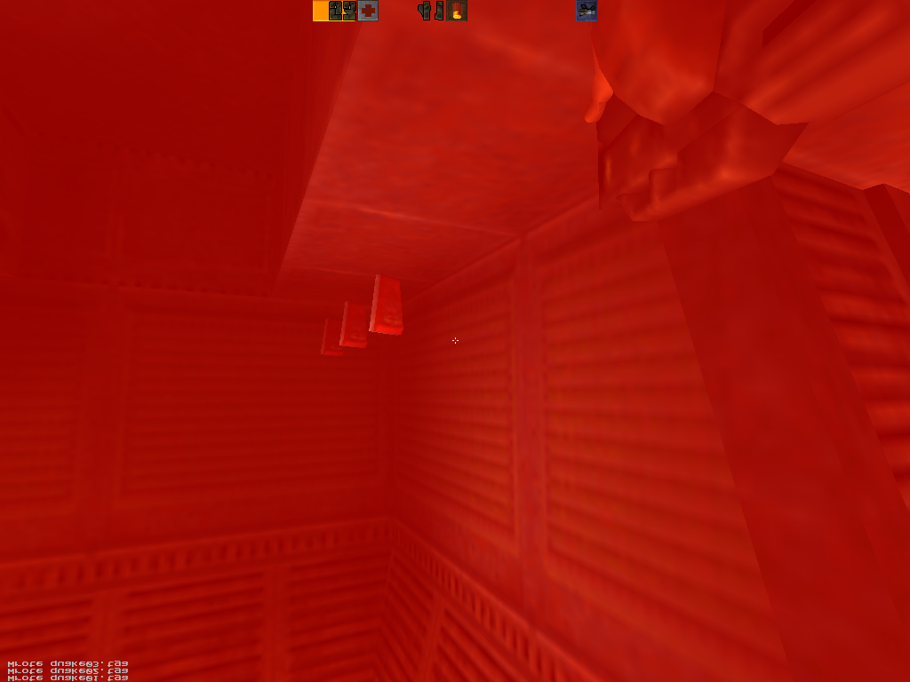
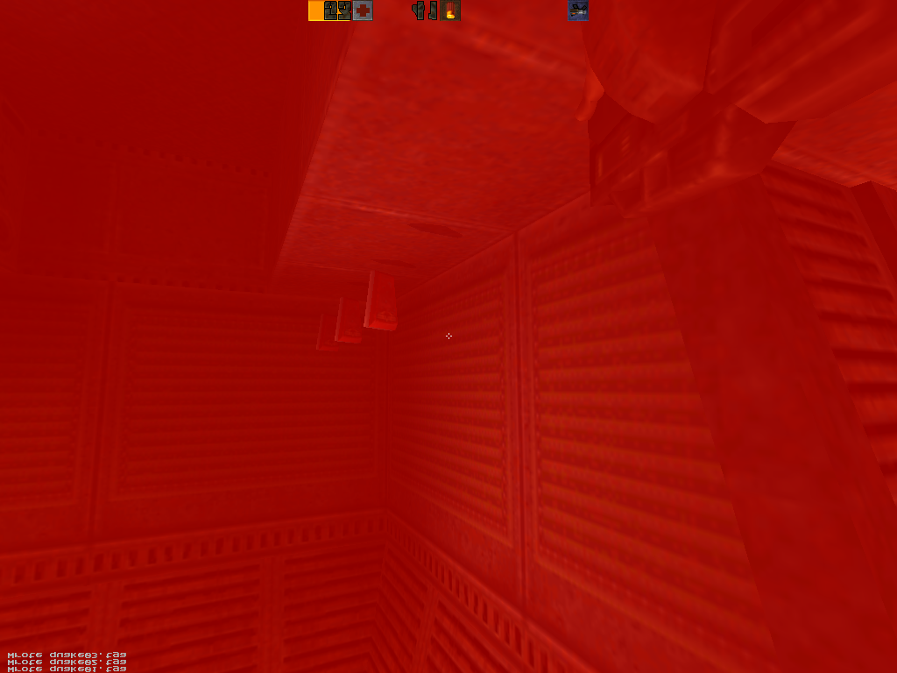
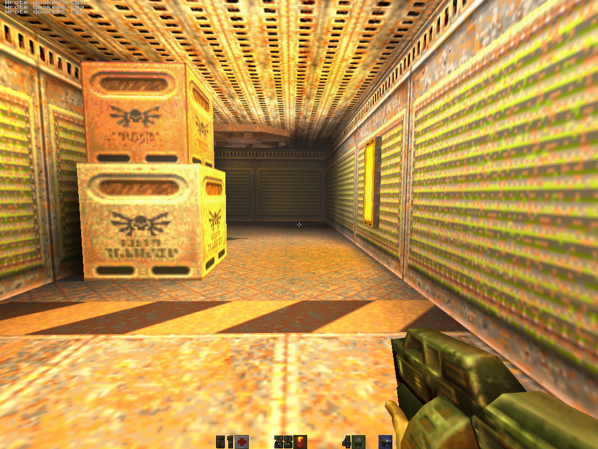
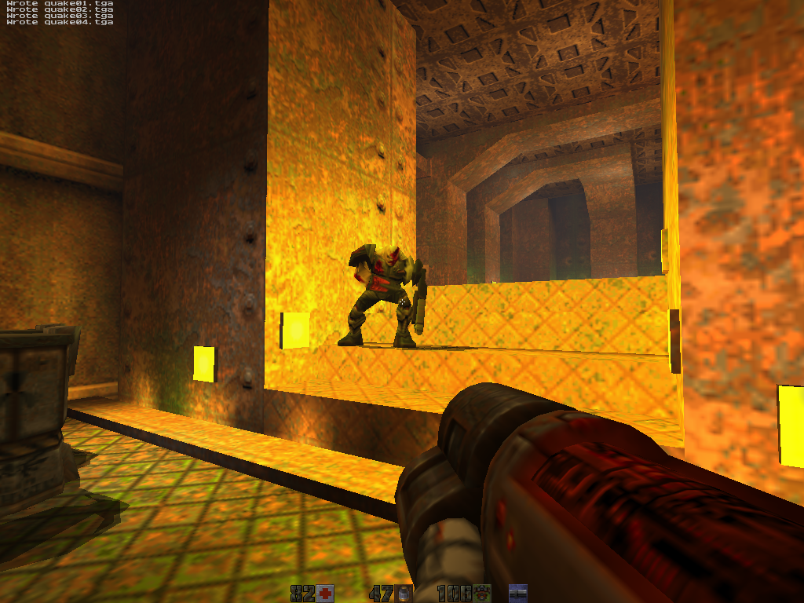

# Quake II — old-Mac port

  

A Quake II port (yquake2 5.11) built as one fat PowerPC + Intel binary inside a
single `Quake2.app`, tested on a range of old Macs — G3, G4, G5 and Intel, from a
1999 Power Mac to a 2019 iMac. The app carries two config layers: a per-arch
baseline picked by the running slice, and a per-machine overlay picked at boot by
`sysctl hw.model`.

> **About this project.** A personal project — I love Quake and I collect and
> tinker with old Macs. My part is the setup and testing: the build, deploy and
> benchmark scripts, and the per-machine settings. The engine and config changes
> were made mostly **with AI (Claude), which I directed and checked against real
> benchmarks on the machines**. The visual features are ported from KMQuake2 and
> yquake2, not written from scratch.

  
  
  
  
  

Same binary, same demo, five GPU generations · 1999 → 2007

## Tested machines

| Machine | CPU | GPU | OS | Slice |
|---|---|---|---|---|
| **yosemite** PowerMac1,1 1999 | 449 MHz PPC 750 | ATI Rage 128 16 MB | 10.3.9 Panther | `ppc_750` |
| **sawtooth** PowerMac3,1 1999 | 500 MHz PPC 7400 | NVIDIA GeForce2 MX 32 MB | 10.4.11 Tiger | `ppc_7400` |
| **quicksilver** PowerMac3,5 2001 | 733 MHz PPC 7450 | ATI Radeon 9000 Pro 64 MB | 10.4.11 Tiger | `ppc_7400` |
| **mini-g4** PowerMac10,1 2005 | 1.25 GHz PPC 7447A | ATI Radeon 9200 32 MB | 10.4.11 Tiger | `ppc_7400` |
| **imac-g5** PowerMac8,2 2004 | 2.0 GHz PPC 970FX | ATI Radeon 9600 128 MB | 10.5.8 Leopard (native 1440×900) | `ppc970` |
| **mini-intel** Macmini2,1 2007 | 2.33 GHz Core 2 Duo | Intel GMA 950 64 MB | 10.7.5 Lion | `x86_64` |
| **imac-2019** iMac19,1 2019 | 3.7 GHz i5-9600K | AMD Radeon Pro 580X 8 GB | 15.7 Sequoia | `x86_64` |

## Framerate

`timedemo demo1`, with the per-machine settings each Mac actually ships with,
median of runs 2 & 3:

| Machine | 640×480 | 1024×768 |
|---|---:|---:|
| iMac 27" (2019 / Radeon Pro 580X) | 712 | 726 |
| Mac mini Intel (Lion / GMA 950) | 219 | 99 |
| Mac mini G4 (Radeon 9200) † | 126 | 99 |
| Sawtooth (G4 / GeForce2 MX) | 73 | 65 |
| Quicksilver (G4 / Radeon 9000) | 69 | 65 |
| Yosemite (G3 / Rage 128) | 46 | 25 |

The iMac G5 runs native 1440×900 only (its Leopard driver hangs on a mode
switch) at ~47 fps — a deliberate visuals-over-framerate choice on that machine.
Every other machine clears its floor (≥ 60 fps G4/Lion, ≥ 20 fps G3). † mini-g4
figures are cool-machine; heat-soaked it drops to ~96/57. Live numbers in
[`benchmarks/results.csv`](benchmarks/results.csv).

## How it's built and benchmarked

One Ubuntu box drives all seven Macs over SSH. The Lion mini does double duty:
it cross-builds the four PowerPC/Intel slices and benches itself. These diagrams
cover the setup, the build pipeline and the timedemo bench loop.

## Features

- **One fat binary** (PPC G3 + G4 AltiVec + G5 + Intel x86_64) in a
  self-contained `Quake2.app`; runs on Mac OS X 10.3.9 Panther through modern
  macOS.
- **Two config layers baked into the `.app`** — a per-arch baseline picked by
  the running slice, and a per-machine overlay dispatched at boot by
  `sysctl hw.model` (applied before video init so the renderer comes up in its
  final mode). Every visual knob is a runtime cvar.
- **GL1 renderer cherry-picks + KMQuake2 visual features** — cvar-driven fog,
  underwater warp, group-draw batching, MSAA, energy-shell glow, lightmapped
  glass/grates, water caustics, extended draw distance.
- **World decals + per-weapon blast marks** — rocket, grenade, plasma, BFG and
  railgun each leave a distinct mark on the surface they actually hit (ported
  from KMQuake2's fragment clipper; `gl_decals`).
- **Stencil shadows on every PowerPC machine**, with a soft blob fallback where
  the GPU can't afford them.
- **Native-res desktop fullscreen** — same-mode display capture; hardwired on
  the iMac G5 where a mode switch hangs the Leopard driver.
- Optional **Apple Watch "tactical computer" companion** (`watchlink`) — streams
  live health / armor / ammo / inventory / objectives to an iPhone + Watch over
  Bonjour; off by default. Companion app:
  [quake2-tactical-watch](https://github.com/matthewdeaves/quake2-tactical-watch).

## Get the latest release

Download the latest disk image from
[**Releases**](https://github.com/matthewdeaves/old-mac-quake2/releases/latest)
(`Quake2-OldMac-<version>.dmg`) — one image runs on Mac OS X 10.3.9 Panther,
Tiger, Leopard, Lion and modern macOS.

1. Mount the `.dmg` and copy `Quake2.app`, `ref_gl.so`, `q2ded` and the `baseq2/`
   folder into one directory (e.g. `~/Desktop/quake2/`).
2. **Add your retail data** — drop your own `pak0.pak`, `pak1.pak`, `pak2.pak`
   into `baseq2/`, and copy the whole `players/` folder from your retail
   `baseq2/` (models/skins — without it multiplayer models render invisible).
   Retail Quake II is on Steam and GOG; the shareware `pak0.pak` also works.
3. Double-click `Quake2.app`. It auto-detects the machine, applies the tuned
   config and opens fullscreen. On modern macOS, clear Gatekeeper with
   `xattr -dr com.apple.quarantine Quake2.app` (not needed on Panther/Tiger/Lion).

## Sister projects

Same machines, same tooling, other id engines:
[**old-mac-quakespasm**](https://github.com/matthewdeaves/old-mac-quakespasm)
(Quake) and [**old-mac-quake3**](https://github.com/matthewdeaves/old-mac-quake3)
(Quake III Arena).

## Credits & licence

Built on [yquake2](https://github.com/yquake2/yquake2) and id Software's Quake II
engine. GPLv2 (see [`yquake2/LICENSE`](yquake2/LICENSE)). Game data (`baseq2`
paks) is **not** included — bring your own from Steam / GOG / retail CD.
