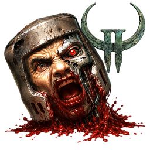
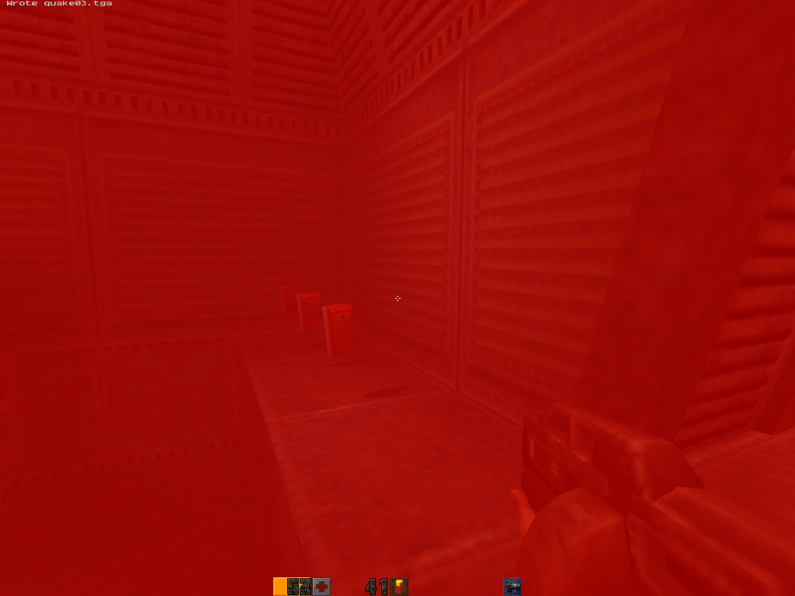
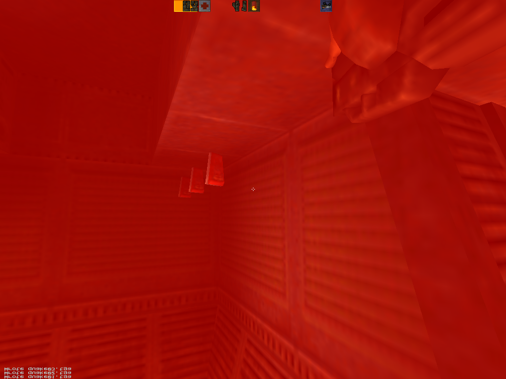
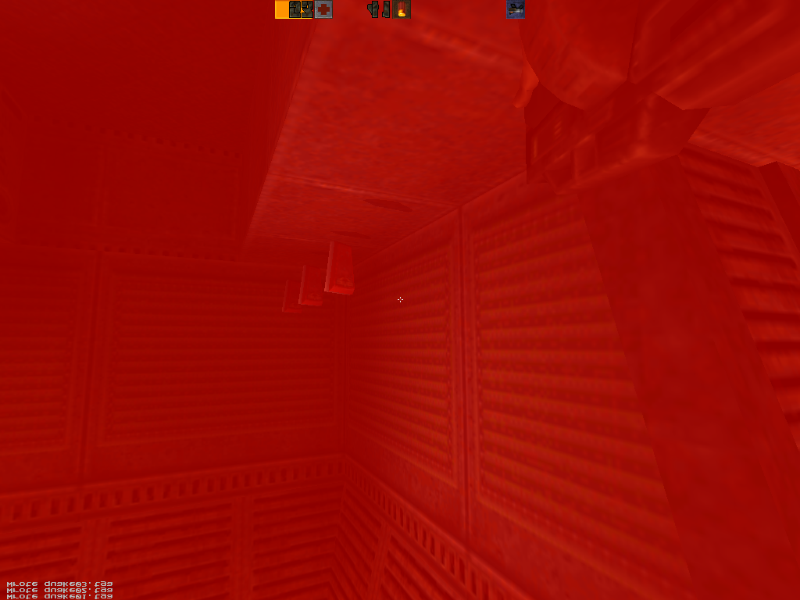
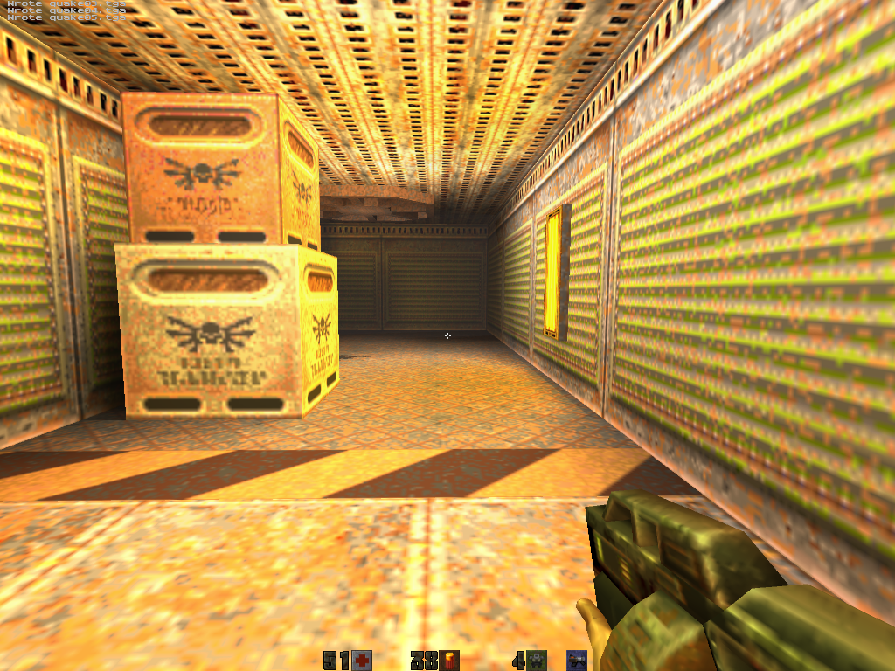
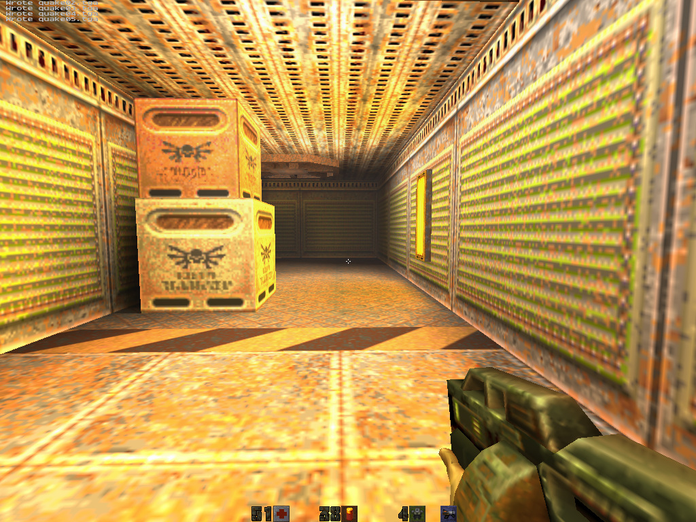
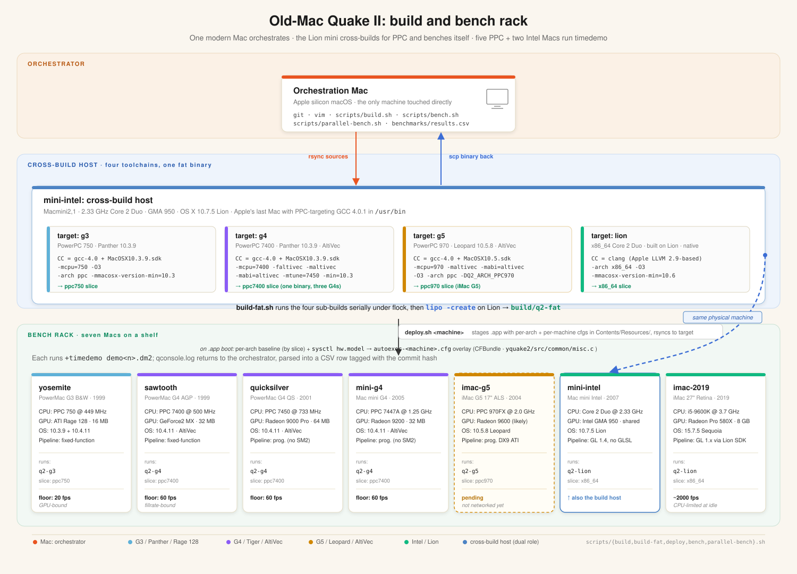
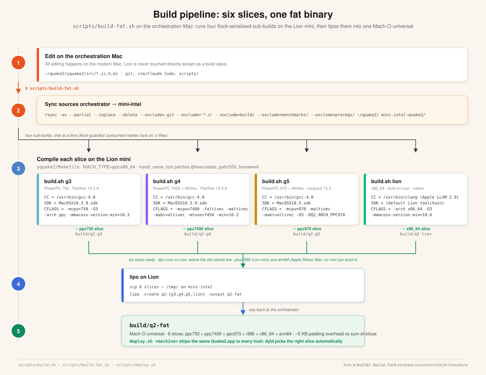
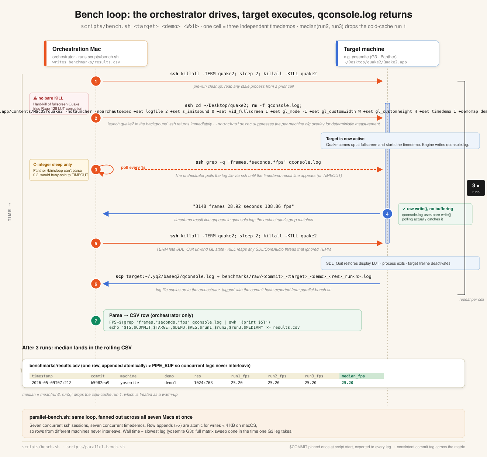

# Quake II: old-Mac port

  

A Quake II port (yquake2 5.11) built as one fat PowerPC + Intel binary inside a
single `Quake2.app`, tested on a range of old Macs, G3, G4, G5 and Intel, from a
1999 Power Mac to a 2019 iMac. The app carries three config layers: shared
controls, a per-arch baseline picked by the running slice, and a per-machine
overlay picked at boot by `sysctl hw.model`. A headless Linux dedicated server
builds from the same tree (see [`server/`](server/README.md)).

> **About this project.** A personal project, I love Quake and I collect and
> tinker with old Macs. My part is the setup and testing: the build, deploy and
> benchmark scripts, and the per-machine settings. The engine and config changes
> were made mostly **with AI (Claude), which I directed and checked against real
> benchmarks on the machines**. The visual features are ported from KMQuake2 and
> yquake2, not written from scratch.

  
  
  
  
  

Same binary, same demo, five GPU generations · 1999 → 2007

## Tested machines

| Machine | CPU | GPU | OS | Slice |
|---|---|---|---|---|
| **yosemite** PowerMac1,1 1999 | 449 MHz PPC 750 | ATI Rage 128 16 MB | 10.3.9 Panther | `ppc750` |
| **yosemite on Tiger** same Mac, 2nd partition | 449 MHz PPC 750 | ATI Rage 128 16 MB | 10.4.11 Tiger | `ppc750` |
| **sawtooth** PowerMac3,1 1999 | 500 MHz PPC 7400 | NVIDIA GeForce2 MX 32 MB | 10.4.11 Tiger | `ppc7400` |
| **quicksilver** PowerMac3,5 2001 | 733 MHz PPC 7450 | ATI Radeon 9000 Pro 64 MB | 10.4.11 Tiger | `ppc7400` |
| **mini-g4** PowerMac10,1 2005 | 1.25 GHz PPC 7447A | ATI Radeon 9200 32 MB | 10.4.11 Tiger | `ppc7400` |
| **imac-g5** PowerMac8,2 2004 | 2.0 GHz PPC 970FX | ATI Radeon 9600 128 MB | 10.5.8 Leopard (native 1440×900) | `ppc970` |
| **mini-intel** Macmini2,1 2007 | 2.33 GHz Core 2 Duo | Intel GMA 950 64 MB | 10.7.5 Lion | `x86_64` |
| **imac-2019** iMac19,1 2019 | 3.7 GHz i5-9600K | AMD Radeon Pro 580X 8 GB | 15.7 Sequoia | `x86_64` |

### Which OS each CPU needs

The binary carries one slice per CPU family, each stamped with its exact CPU subtype:

| CPU | Slice | OS needed | Tested on |
|---|---|---|---|
| G3 (750) | `ppc750` | 10.3.9 Panther or later | 10.3.9 and 10.4.11 |
| G4 (7400 / 7450 / 7447A) | `ppc7400` | 10.3.9 Panther or later | 10.4.11 |
| G5 (970) | `ppc970` | **10.5 Leopard, a G5 on 10.3 or 10.4 is not supported** | 10.5.8 |
| Intel, 64-bit | `x86_64` | 10.6 Snow Leopard or later | 10.7.5 and 15.7 |

`dyld` picks a slice by CPU alone; the OS plays no part in it. A Mac running an OS
older than its slice needs gets that slice anyway rather than falling back to a lower
one, and won't launch, which is why the G3 and G4 slices are both built at min 10.3
even though no G4 here runs Panther. Two rows are honest about the gap between what is
built and what is tested: **a G4 on Panther and an Intel Mac on Snow Leopard should both
work but neither has been run on hardware** (no such machine in the fleet). The G5 is the
exception, its slice genuinely needs 10.5, so that row is a real floor, not a gap in
testing.

32-bit-only Intel Macs (Core Duo / Core Solo, 2006) have no slice at all: there is no
`i386` build, and no such machine here to make one on.

## Framerate

`timedemo demo1`, with the per-machine settings each Mac actually ships with,
median of runs 2 & 3:

| Machine | 640×480 | 1024×768 |
|---|---:|---:|
| Mac mini Intel (Lion / GMA 950) | 207.9 | 92.6 |
| Sawtooth (G4 / GeForce2 MX) † | 72.9 | 65.5 |
| Mac mini G4 (Radeon 9200) | 73.9 | 38.8 |
| Quicksilver (G4 / Radeon 9000) | 67.0 | 57.6 |
| Yosemite (G3 / Panther / Rage 128) | 50.4 | 25.5 |
| Yosemite (G3 / Tiger / Rage 128) | 49.1 | 25.8 |
| iMac 27" (2019 / Radeon Pro 580X) † | 698.8 | 732.6 |

The iMac G5 runs native 1440×900 only (its Leopard driver hangs on a mode
switch) at 46.8 fps, a deliberate visuals-over-framerate choice there.

The two G3 rows are the same Mac booted from two partitions, running the
byte-identical binary out of the same disk image: **the OS costs it nothing
measurable.** On the production config both come out at 21.0 fps exactly.

† Not benched for this release, sawtooth and the 2019 iMac were offline.
Those rows are carried forward from before the v2.5.1 stencil-shadow rollout,
so the sawtooth figures in particular are likely optimistic; treat them as
stale rather than current.

**On the G4 numbers.** Earlier releases quoted ~99–108 fps at 1024×768 for the
Mac mini G4. That figure was wrong: the benches behind it were accidentally run
at a 1×1-pixel render (a `1` landed in the resolution argument where the run
count was meant to go), so they measured CPU cost with essentially no fill work
and got quoted as if they were real. Every number in the table above is a
genuine full-resolution run on a freshly rebooted machine. The honest position
is that the mini G4 sits just under the 40 fps target at 1024×768 with the full
visual stack, and comfortably over it at 640×480. `scripts/bench.sh` now
rejects a malformed resolution instead of quietly benching nonsense. Live
numbers in [`benchmarks/results.csv`](benchmarks/results.csv).

## How it's built and benchmarked

One modern Mac drives the whole fleet over SSH. The Lion mini does double duty:
it cross-builds the four PowerPC/Intel slices and benches itself. These diagrams
cover the setup, the build pipeline and the timedemo bench loop.

## Features

- **One fat binary** (PPC G3 + G4 AltiVec + G5 + Intel x86_64) in a
  self-contained `Quake2.app`; runs on Mac OS X 10.3.9 Panther through modern
  macOS.
- **Three config layers baked into the `.app`**, shared controls, a per-arch
  baseline picked by the running slice, and a per-machine overlay dispatched at
  boot by `sysctl hw.model` (all applied before video init, so the renderer
  comes up in its final mode). Every visual knob is a runtime cvar.
- **GL1 renderer cherry-picks + KMQuake2 visual features**, cvar-driven fog,
  underwater warp, group-draw batching, MSAA, energy-shell glow, lightmapped
  glass/grates, water caustics, extended draw distance.
- **World decals + per-weapon blast marks**, rocket, grenade, plasma, BFG and
  railgun each leave a distinct mark on the surface they actually hit (ported
  from KMQuake2's fragment clipper; `gl_decals`).
- **Stencil shadows on every PowerPC machine**, with a soft blob fallback where
  the GPU can't afford them.
- **Native-res desktop fullscreen**, same-mode display capture; hardwired on
  the iMac G5 where a mode switch hangs the Leopard driver.
- Optional **Apple Watch "tactical computer" companion** (`watchlink`), streams
  live health / armor / ammo / inventory / objectives to an iPhone + Watch over
  Bonjour; off by default. Companion app:
  [quake2-tactical-watch](https://github.com/matthewdeaves/quake2-tactical-watch).

## Get the latest release

Download the latest disk image from
[**Releases**](https://github.com/matthewdeaves/old-mac-quake2/releases/latest)
(`Quake2-OldMac-<version>.dmg`), one image runs on Mac OS X 10.3.9 Panther,
Tiger, Leopard, Lion and modern macOS.

1. Mount the `.dmg` and copy `Quake2.app`, `ref_gl.so`, `q2ded` and the `baseq2/`
   folder into one directory (e.g. `~/Desktop/quake2/`).
2. **Add your retail data**, drop your own `pak0.pak`, `pak1.pak`, `pak2.pak`
   into `baseq2/`, and copy the whole `players/` folder from your retail
   `baseq2/` (models/skins, without it multiplayer models render invisible).
   Retail Quake II is on Steam and GOG; the shareware `pak0.pak` also works.
3. Double-click `Quake2.app`. It auto-detects the machine, applies the tuned
   config and opens fullscreen. On modern macOS, clear Gatekeeper with
   `xattr -dr com.apple.quarantine Quake2.app` (not needed on Panther/Tiger/Lion).

## Sister projects

Same machines, same tooling, other id engines:
[**old-mac-quakespasm**](https://github.com/matthewdeaves/old-mac-quakespasm)
(Quake) and [**old-mac-quake3**](https://github.com/matthewdeaves/old-mac-quake3)
(Quake III Arena).

## Credits & licence

Built on [yquake2](https://github.com/yquake2/yquake2) and id Software's Quake II
engine. GPLv2 (see [`yquake2/LICENSE`](yquake2/LICENSE)). Game data (`baseq2`
paks) is **not** included, bring your own from Steam / GOG / retail CD.
